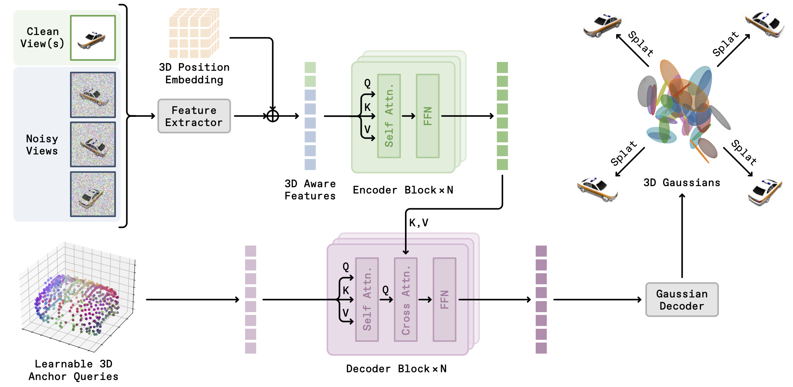

# SparseGen

## About

This repository contains the code for **Rethinking Image-to-3D Generation with Sparse Queries: Efficiency, Capacity, and Input-View Bias**.

> Authors: Zhiyuan Xu, Jiuming Liu, Yuxin Chen, Masayoshi Tomizuka, Chenfeng Xu, Chensheng Peng  
> Affiliations: UC Berkeley, University of Cambridge, UT Austin

<div align="center">
  
  <a href="https://arxiv.org/abs/2604.13905"></a>
</div>

*We present SparseGen, a novel framework for efficient image-to-3D generation, which exhibits low input-view bias while being significantly faster. Unlike traditional approaches that rely on dense volumetric grids, triplanes, or pixel-aligned primitives, we model scenes with a compact sparse set of learned 3D anchor queries and a learned expansion operator that decodes each transformed query into a small local set of 3D Gaussian primitives. Trained under a rectified-flow reconstruction objective without 3D supervision, our model learns to allocate representation capacity where geometry and appearance matter, achieving significant reductions in memory and inference time while preserving multi-view fidelity. We introduce quantitative measures of input-view bias and utilization to show that sparse queries reduce overfitting to conditioning views while being representationally efficient. Our results argue that sparse set-latent expansion is a principled, practical alternative for efficient 3D generative modeling.*


<div align="center">
  
</div>

Given $V$ input views (clean and/or noisy) with known camera poses, an image encoder (with adaLN timesteps) and a 3D position encoder generate position-aware image features. A sparse set of learnable 3D anchor queries attends to these fused features in a transformer-based expansion network and is decoded into a compact set of 3D Gaussians. Finally, the generated Gaussians are rendered for target views via differentiable splatting, enabling fast, high-quality 3D generation and rendering.


## Setup

The current codebase expects Python with CUDA-enabled PyTorch.

Create and activate a conda environment:

```bash
conda create -n sparsegen python=3.10 git cmake -y
conda activate sparsegen
```

Install the CUDA 12.4 toolchain inside the conda env:

```bash
conda install -c "nvidia/label/cuda-12.4.0" cuda-toolkit
```

Install prebuilt PyTorch and torchvision wheels for CUDA 12.4:

```bash
python -m pip install --index-url https://download.pytorch.org/whl/cu124 torch==2.4.0 torchvision==0.19.0
```

Install `ninja`, then build `pytorch3d` from source:

```bash
python -m pip install ninja
CUDA_HOME="$CONDA_PREFIX" FORCE_CUDA=1 python -m pip install --no-build-isolation "git+https://github.com/facebookresearch/pytorch3d.git@stable"
```

Install the remaining Python dependencies:

```bash
python -m pip install -r requirements.txt
```

Notes:
- `gsplat` and `pytorch3d` are version-sensitive. The setup above was verified with PyTorch 2.4 and CUDA 12.4 for this repo.
- A working `sparsegen` env was verified with `nvcc 12.4`, `torch 2.4.0+cu124`, `torchvision 0.19.0+cu124`, `pytorch3d 0.7.8`, and `gsplat 1.5.3`.
- `pytorch3d` was built successfully from the `stable` tag with `CUDA_HOME="$CONDA_PREFIX"` and `--no-build-isolation`.
- `ninja` is installed before the `pytorch3d` build to avoid slow fallback compilation.
- [`requirements.txt`](requirements.txt) intentionally excludes `torch`, `torchvision`, and `pytorch3d` because they must be installed separately in that order.
- Training uses `wandb` in offline mode by default through [`configs/spgen.yaml`](configs/spgen.yaml).

## Data

Download the dataset from [here](https://drive.google.com/file/d/1TWKGrbpGwyjVrhG0bTxaQBkbElCVi3YA/view?usp=sharing).

After downloading, unpack the dataset to a local directory and update the dataset root in [`data_manager/srn.py`](data_manager/srn.py):

```python
SHAPENET_DATASET_ROOT = "/path/to/SPG_SRN"
```

Expected structure:

```text
SPG_SRN/
└── srn_cars/
    ├── cars_train/
    │   └── <example_id>/
    │       ├── intrinsics.txt
    │       ├── rgb/
    │       │   ├── 000000.png
    │       │   └── ...
    │       └── opc/
    │           ├── 000000.png
    │           └── ...
    ├── cars_val/
    │   └── <example_id>/
    │       ├── intrinsics.txt
    │       ├── rgb/
    │       └── opc/
    └── cars_test/
        └── <example_id>/
            ├── intrinsics.txt
            ├── rgb/
            └── opc/
```

## Training

Training is launched through [`scripts/run_train.sh`](scripts/run_train.sh), which wraps [`train.py`](train.py) with `torchrun`.

Use the current training config in [`configs/spgen.yaml`](configs/spgen.yaml):

```bash
bash scripts/run_train.sh
```

By default, [`scripts/run_train.sh`](scripts/run_train.sh) uses:

```bash
torchrun --standalone --nproc-per-node=2 train.py --config-name spgen
```

Adjust `--nproc-per-node` in the script if your setup differs.

Hydra writes outputs under its run directory, including the resolved config and checkpoints saved during training.

## Evaluation

Evaluation is launched through [`scripts/run_eval.sh`](scripts/run_eval.sh), which wraps [`eval.py`](eval.py) with config [`configs_eval/default.yaml`](configs_eval/default.yaml).

Download the pretrained checkpoint from [here](https://drive.google.com/file/d/1Fr3VrChA_BU51Mz_IcAqz6mC8ptVol77/view?usp=sharing)


Then extract it so that the checkpoint directory contains both `model.pth` and `.hydra/config.yaml`:

```bash
tar -xzf ckpt_srn.tar.gz
```

Expected structure:

```text
ckpt_srn/
├── .hydra/
│   └── config.yaml
└── model.pth
```

The provided evaluation script is:

```bash
bash scripts/run_eval.sh
```

Update the checkpoint path in [`scripts/run_eval.sh`](scripts/run_eval.sh) before running:

```bash
python3 eval.py \
        model_path=/path/to/ckpt
```

The current evaluation path:
- expects a checkpoint file passed as `model_path`
- loads the training config from the sibling `.hydra/config.yaml` next to that checkpoint
- runs one-sample, single-GPU evaluation
- reports `PSNR`, `LPIPS`, `SSIM`, and `FID`

## Repo Structure

- [`train.py`](train.py): training entrypoint
- [`eval.py`](eval.py): evaluation entrypoint
- [`configs/spgen.yaml`](configs/spgen.yaml): training config
- [`configs_eval/default.yaml`](configs_eval/default.yaml): evaluation config
- [`model/spgen_model.py`](model/spgen_model.py): SparseGen model
- [`model/sp_trans.py`](model/sp_trans.py): transformer backbone
- [`model/renderer_gs.py`](model/renderer_gs.py): Gaussian renderer
- [`model/sparse_diffusion.py`](model/sparse_diffusion.py): training wrapper and losses
- [`data_manager/srn.py`](data_manager/srn.py): SRN dataset manager
- [`evaluation/generator.py`](evaluation/generator.py): evaluation-time sampling
- [`evaluation/metricator.py`](evaluation/metricator.py): evaluation metrics

## Acknowledgement

We thank the [viewset-diffusion](https://github.com/szymanowiczs/viewset-diffusion) repository for open-source code.

## Citation

If you find this repository useful, please consider citing:

```bibtex
@article{xu2026rethinking,
  title={Rethinking Image-to-3D Generation with Sparse Queries: Efficiency, Capacity, and Input-View Bias},
  author={Xu, Zhiyuan and Liu, Jiuming and Chen, Yuxin and Tomizuka, Masayoshi and Xu, Chenfeng and Peng, Chensheng},
  journal={arXiv preprint arXiv:2604.13905},
  year={2026}
}
```
